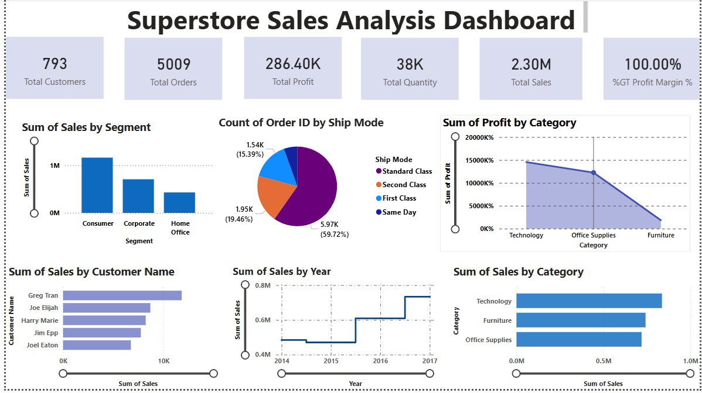

📊 Superstore Sales Analysis Dashboard (Power BI)

This project presents an interactive Sales Analytics Dashboard built using Power BI to analyze business performance using the Sample Superstore dataset.

The dashboard provides insights into sales, profit, customers, and shipping trends, helping businesses understand their performance and make data-driven decisions.

🚀 Project Overview

The dashboard visualizes key business metrics such as:

Total Customers

Total Orders

Total Profit

Total Quantity Sold

Total Sales

Profit Margin %

These KPIs provide a quick overview of overall business performance.

📈 Dashboard Insights

The dashboard includes the following visualizations:

1️⃣ Sales by Segment

Shows how sales are distributed across:

Consumer

Corporate

Home Office

2️⃣ Orders by Ship Mode

A pie chart showing order distribution by shipping methods:

Standard Class

Second Class

First Class

Same Day

3️⃣ Profit by Category

Displays profit contribution from:

Technology

Office Supplies

Furniture

4️⃣ Top Customers by Sales

Highlights the customers who generated the highest sales.

5️⃣ Sales Trend by Year

Shows yearly sales growth to identify business trends.

6️⃣ Sales by Category

Compares sales performance across different product categories.

🛠 Tools & Technologies

Power BI

Data Visualization

Data Modeling

DAX Measures

Business Intelligence

## Dashboard Preview

📊 Key Learnings

Creating Power BI KPI cards

Building interactive visualizations

Writing DAX measures

Designing business dashboards

📌 Dataset

Sample Superstore dataset used for sales analysis.
